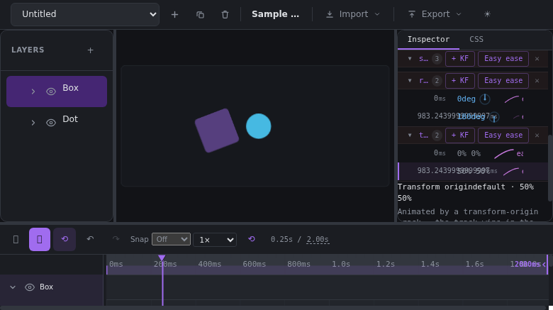
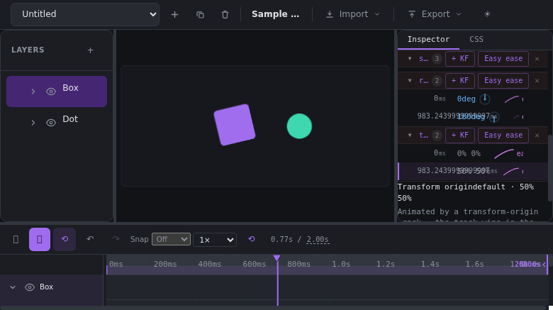
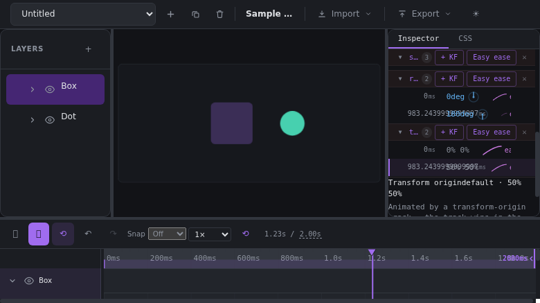
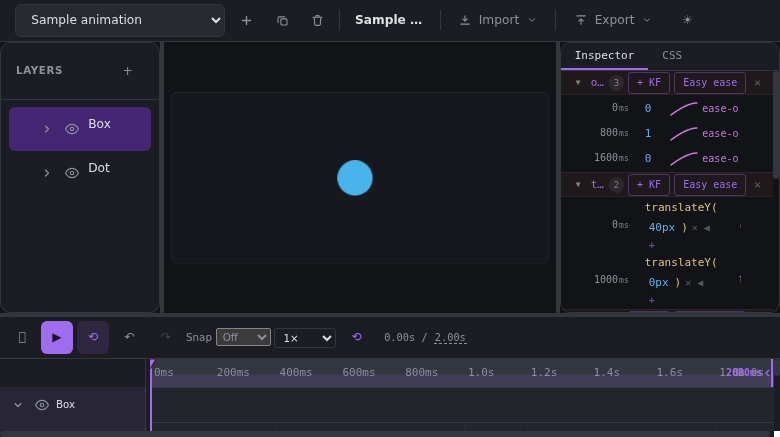

# Transform-Origin-Tracks verstehen — Bericht zu PR #102 (2026-08-25)

> Für Nicolas, einsteigerfreundlich. Was PR #102 eigentlich tut, live getestet
> am laufenden System (CDP gegen den Dev-Server, echte UI-Klicks, keine
> Unit-Test-Zauberei). Screenshots unten sind echtes App-Material.

## 1. Das Feature in einem Satz

`transform-origin` ist der **Drehgelenkspunkt** eines Layers — der Punkt, um
dem sich rotate/scale ausrichten. PR #102 macht diesen Punkt **animierbar**:
Statt ihn einmal festzunageln, kann er jetzt über die Zeit wandern.

## 2. Vorher / Nachher

|                 | Vor #102 (Phase A)                                              | Ab #102 (Phase B)                                                       |
| --------------- | --------------------------------------------------------------- | ----------------------------------------------------------------------- |
| Pivot setzen    | statisch pro Layer (Picker/Grid im Inspector)                   | zusätzlich als **Track mit Keyframes**                                  |
| Pivot über Zeit | ❌ fixiert                                                      | ✅ interpoliert („Ecke → Mitte" in 1s)                                  |
| Import aus CSS  | `transform-origin` in @keyframes wurde **verworfen** (+Warnung) | wird als Track importiert                                               |
| Inspector       | statische Controls immer sichtbar                               | klappen zusammen, sobald ein Track existiert (eine Quelle der Wahrheit) |

**Wichtig zur Einordnung**: Das ist ein Nischen-Effekt. Die meisten Animationen
brauchen nie einen bewegten Drehpunkt. Der reale Wert: (a) bestimmte Effekte
werden erst möglich (Klappeffekte, rotierende Zeiger mit wanderndem Zentrum,
Charakter-Gliedmaßen), und (b) Keyforge deckt jetzt _jedes_ animierbare
CSS-Property ab — inklusive Round-Trip über Import/Export.

## 3. Konkretes Beispiel (live getestet)

Setup über die normale UI: Sample geladen → Layer „Box" selektiert → im
Inspector zweimal „+ Add property track": `rotate` und `transform-origin`.

Keyframes:

- `rotate`: 0 ms → `0deg`, ~983 ms → `180deg`
- `transform-origin`: 0 ms → `0% 0%` (obere linke Ecke), ~983 ms → `50% 50%` (Mitte)

Dann Play gedrückt. Drei Frames aus dem echten Preview:

**Früh (~200 ms)** — Pivot noch nahe der Ecke, Box dreht sichtbar „um die Ecke":

**Mitte (~650 ms)** — Pivot auf dem Weg zur Mitte, Rotationseindruck ändert den Charakter:

**Spät (~1050 ms)** — Pivot in der Mitte angekommen, Box dreht „auf der Stelle":

Der Unterschied früh→spät ist der ganze Punkt des Features: **gleiche
Rotation, anderes Gelenk** — und das Gelenk selbst animiert hier mit.

## 4. Wie man es benutzt (5 Schritte)

1. Layer in der Timeline anwählen.
2. Inspector unten: „+ Add property track" → `transform-origin` wählen.
3. Playhead dorthin bewegen, wo der Pivot starten soll → „+ KF" im Origin-Track → Wert eintippen (`0% 0%`).
4. Playhead zum Endzeitpunkt → „+ KF" → Zielwert (`50% 50%`).
5. Fertig — zwischen den Keyframes interpoliert der Pivot automatisch (pro Achse, bei passenden Einheiten; sonst hält er).

Sobald der Track existiert, zeigt der Inspector statt der statischen
Origin-Kontrollen nur noch diesen Hinweis (Track gewinnt, keine doppelte
Wahrheit):

## 5. Was ich getestet habe und was dabei auffiel

**Funktioniert (per UI verifiziert):**

- Track-Anlage über das Property-Dropdown; taucht als Timeline-Row auf (rowModel, ohne Timeline-Code).
- Keyframes anlegen/löschen über „+ KF" / ✕; Werte editieren über Chips (Text-Chips für `%`-Paare, Nummer+Feld für Grad).
- Interpolation zwischen zwei KFs (Pair-Lerp pro Achse, Einheiten müssen je Achse passen — sonst Hold).
- Inspector-Collapse: statische Controls weichen dem Hinweis „Animated by a transform-origin track".
- Preview wendet den animierten Pivot im Playback an (Screenshots oben).

**Dabei aufgefallen (ehrlich):**

1. **Kein UI-Schalter für die Debug-Ansicht**: `setShowOrigins` existiert im Store, aber kein Button/Checkbox ruft es auf — die Pivot-Crosshairs sind aktuell nur im Pick-Modus sichtbar. Genau bei diesem Feature wäre der Toggle nützlich. (Phase-A-Salvage-Verlust #2, nach #103.)
2. **Chip-Bearbeitung von Zahlen** läuft über NumberUnitField (Zahl + Einheit getrennt) — funktional, aber beim Testen per Skript erstmal überraschend. Kein Bug, nur Verhalten.
3. Beide KFs desselben Tracks dürfen nicht dieselbe Zeit haben — passiert leicht, wenn der Playhead nicht dort steht, wo man glaubt. Die App sortiert stabil, räudt aber nicht.

## 6. Empfehlung

Das Feature funktioniert Ende-zu-Ende und ist solide getestet (519 Unit-Tests
auf dem Branch, +13 gegenüber Main). Es ist aber — ehrlich gesagt —
Low-Priority-Wert für den Alltag. Mein Vorschlag: **#102 mergen** (damit ist
das Property-System vollständig und Import verliert nichts mehr), oder
**parken bis ein konkreter Anwendungsfall es braucht**. Beide Wege sind
vertretbar; der Code veraltet nicht, während er im Branch liegt.
